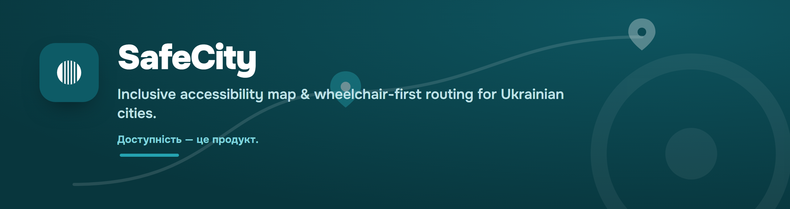
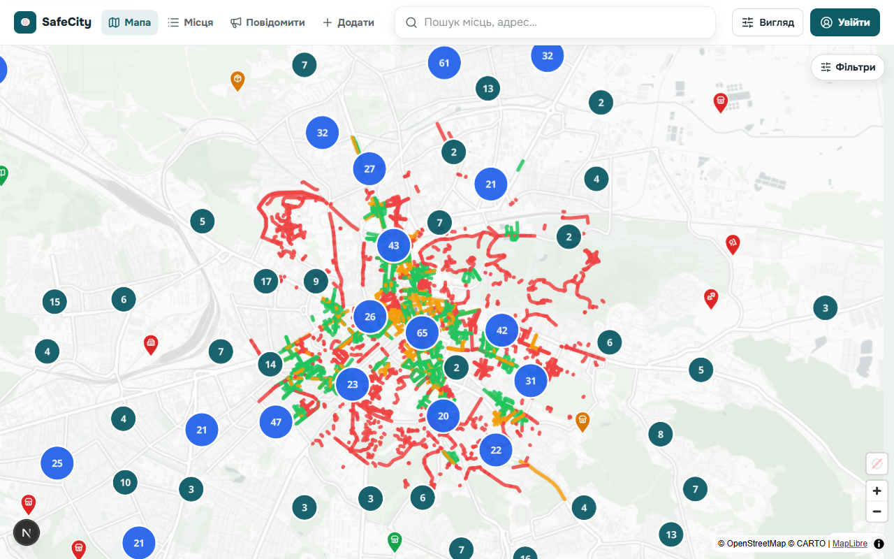
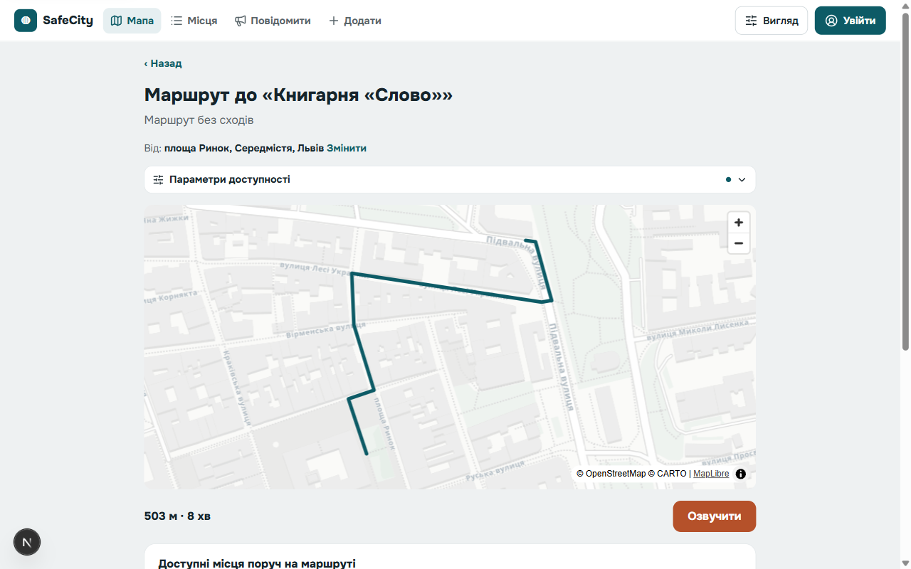
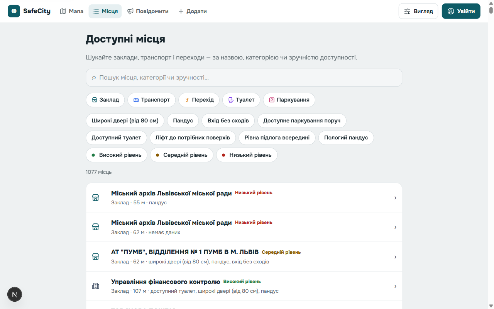
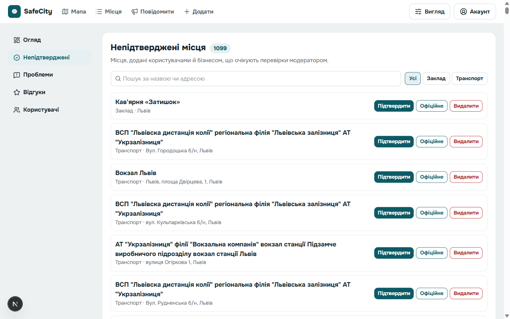
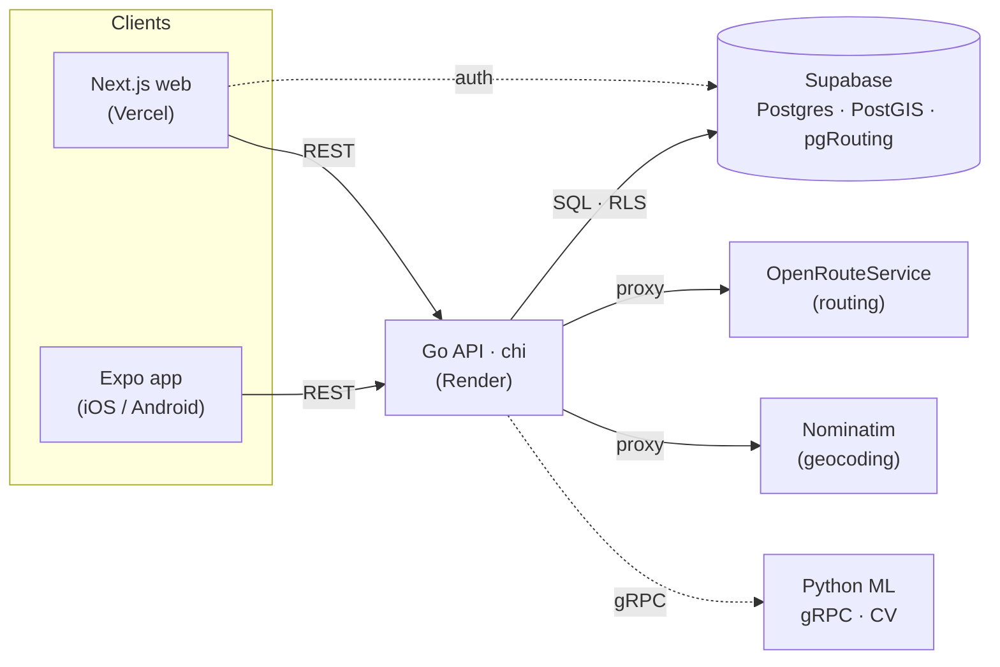

<div align="center">



# SafeCity

**Inclusive accessibility map & wheelchair-first routing for Ukrainian cities.**
Find accessible places, route *around* inaccessible sidewalks, and turn barriers into civic action.

[](https://github.com/ryl1k/safecity/actions/workflows/ci.yml)


</div>

---

## Why SafeCity

For millions of people with reduced mobility, the city is unpredictable — you can't tell in advance whether a place is reachable, and ordinary maps route you straight past stairs, curbs and narrow sidewalks. SafeCity is the map that **routes a wheelchair user around inaccessible segments** and is **honest when there's no accessible detour** — instead of sending them into a dead end.

It fuses three data sources nobody else combines — the government **«Мапа безбар'єрності»** dataset, **OpenStreetMap**, and **live community reports** — and turns that into a product for citizens, businesses and cities. Launched in **Lviv**.

## ✨ Features

- **🗺 Accessibility map** — places (venues, transit, crossings, toilets, parking) and sidewalk segments, each tinted by an honest **low / medium / high** accessibility level. Filter by category and by specific features (ramp, step-free entrance, door width…).
- **♿ Wheelchair routing** — routes that steer around impassable segments, with adjustable preferences (min width, max incline, avoid high curbs). Public-transport mode shows per-leg accessibility. When no accessible detour exists, it **says so** rather than pretending.
- **🧭 Live turn-by-turn navigation** — Google-Maps-style guidance that follows your position, announces turns, and updates distance-to-turn and distance-remaining as you move.
- **🤝 Civic loop** — report an accessibility barrier with photos, let others confirm it, and spin up a **petition to the city** straight from a confirmed problem.
- **➕ Community data** — a step-by-step wizard to add places and mark pedestrian paths with their accessibility attributes.
- **🏢 Business dashboard** — businesses claim their points, request verification, and see accessibility analytics (views, arrivals, "searched-but-couldn't-reach" demand).
- **🛡 Moderation console** — a dashboard for moderators to verify places, resolve problems, review reports and manage roles.

## 📸 Screenshots

| Accessibility map | Accessible routing |
| :---: | :---: |
|  |  |
| **Places directory** | **Moderation console** |
|  |  |

## 🏗 Architecture



The **Go API** sits in front of Supabase (hybrid: RLS enforced via JWT claims), proxies routing/geocoding so keys stay server-side, and talks to an optional **Python ML** service over gRPC for photo moderation and accessibility-feature inference. Wheelchair routing runs through **OpenRouteService** with server-built avoidance around impassable segments, and reports honestly when a route has to run alongside an inaccessible stretch.

## 🧰 Tech stack

| Layer | Tech |
| --- | --- |
| **Web** | Next.js (App Router), TypeScript, MapLibre GL |
| **Mobile** | Expo / React Native (iOS + Android) |
| **API** | Go 1.26, `chi`, `pgx` |
| **Data** | Supabase — Postgres, **PostGIS**, **pgRouting**, Auth, Storage |
| **Routing / geo** | OpenRouteService, Nominatim, Transitous (public transport) |
| **ML** | Python, gRPC (server-side CV) |
| **Tooling** | Turborepo, pnpm, ESLint, golangci-lint, testcontainers |

## 📁 Project structure

```
apps/
  web/             Next.js — public app + /admin console + /business dashboard
  mobile/          Expo (React Native) — iOS / Android
  api/             Go API (chi) — Supabase + ORS/Nominatim proxies, routing, import CLIs
  ml/              Python gRPC CV microservices (server-side)
packages/
  shared/          types, zod schemas, accessibility rules engine, api-client
  design-tokens/   colors / type / space + themes (standard · high-contrast · dark)
  proto/           protobuf contracts (ML gRPC)
  config/          shared eslint / tsconfig / prettier presets
supabase/          migrations, RLS policies, seed
tooling/
  importers/       OSM Overpass · MyMaps KML · «Мапа безбар'єрності» import scripts
```

**Dependency rule:** `apps/*` → `packages/*`; packages never depend on apps; `packages/shared` is platform-agnostic (no React, no Node-only APIs).

## 🚀 Getting started

### Prerequisites

- **Node ≥ 20** and **pnpm 9** (`corepack enable`)
- **Go 1.26** (for the API)
- A **Supabase** project (Postgres/PostGIS/Auth are managed — not run locally)
- An **OpenRouteService** API key

### 1. Install

```bash
pnpm install
```

### 2. Configure environment

Server + tooling read the repo-root `.env`; the web's public client reads `apps/web/.env.local`.

```bash
# .env  (server-side — never shipped to the browser)
DATABASE_URL=postgresql://...             # Supabase transaction-pooler URI (port 6543)
SUPABASE_URL=https://<ref>.supabase.co
SUPABASE_PUBLISHABLE_KEY=...
SUPABASE_SECRET_KEY=...                    # service key — server only
ORS_API_KEY=...
CORS_ORIGINS=http://localhost:3000

# apps/web/.env.local  (public — inlined into the web build)
NEXT_PUBLIC_API_URL=http://localhost:8080
NEXT_PUBLIC_SUPABASE_URL=https://<ref>.supabase.co
NEXT_PUBLIC_SUPABASE_PUBLISHABLE_KEY=...   # the Supabase anon / publishable key
```

Apply the schema (PostGIS, pgRouting, functions, seed):

```bash
pnpm db:migrate       # applies supabase/migrations/*.sql
pnpm db:seed          # optional demo data
```

### 3. Run

<details>
<summary><b>Local dev (recommended)</b></summary>

```bash
# API (Go) — loads the repo-root .env
cd apps/api && go run ./cmd/server              # → :8080

# Web (Next.js)
pnpm --filter @safecity/web dev                 # → :3000

# ML (optional, Python gRPC)
cd apps/ml && pip install -e ".[dev]" && python -m safecity_ml   # → :50051
```

To route the web through the Go API, set `NEXT_PUBLIC_API_URL=http://localhost:8080` in `apps/web/.env.local` (otherwise it talks to Supabase directly).
</details>

<details>
<summary><b>Docker (everything at once)</b></summary>

```bash
# web build args (NEXT_PUBLIC_*) come from apps/web/.env.local; server vars from .env
docker compose --env-file apps/web/.env.local up --build
# web → :3000 · api → :8080 · ml → :50051
```
</details>

The API also ships seed/import CLIs (`go run ./cmd/{import-osm,import-mymaps,dedupe}`).

## 🗃 Data & the honesty principle

SafeCity fuses three sources: the government **«Мапа безбар'єрності»** dataset (CC-BY), **OpenStreetMap** (ODbL), and **live community reports**. Street segments are rated by the *worse of* surface and smoothness in SQL, so a rough cobblestone street can never masquerade as smooth asphalt.

The guiding rule: **tell the truth over faking accessibility.** Where data is missing the level is *unknown* (not invented), and where a route has to use an inaccessible stretch, the UI warns *"no accessible detour available"* instead of hiding it.

## ♿ Accessibility

Accessibility is the product, not a feature — **WCAG 2.2 AA is the minimum bar on every screen**: visible keyboard focus, screen-reader labels, reduced-motion support, and three built-in themes (standard, high-contrast, dark).

## ☁️ Deployment

| Service | Platform |
| --- | --- |
| Web (Next.js) | **Vercel** — root directory `apps/web` |
| API (Go) | **Render** — Docker, `apps/api/Dockerfile` |
| Postgres / Auth | **Supabase** — managed |

Deploy config is committed: [`render.yaml`](render.yaml) (Render Blueprint) and [`apps/web/vercel.json`](apps/web/vercel.json). Both platforms deploy on push to `main` via their GitHub integration; set `CORS_ORIGINS` on Render to your Vercel domain(s).

## 🧪 Testing & CI

```bash
pnpm type-check                 # TS across the workspace
pnpm lint                       # eslint + golangci-lint
pnpm test                       # unit tests
cd apps/api && go test ./...    # RLS + handler + testcontainers integration
```

GitHub Actions (`.github/workflows/`) run lint / type-check / test / build on every PR (path-filtered per app), and build & push Docker images on `main`.

## 🤝 Contributing

Issues and PRs welcome. Keep changes scoped, respect the `apps → packages` dependency rule, and make sure `pnpm lint`, `pnpm type-check`, and `go test ./...` stay green — CI enforces all three.

## 📄 License

- **Data:** government «Мапа безбар'єрності» (CC-BY) · OpenStreetMap (ODbL) — attribution required.
- **Code:** _to be finalized_ — add a top-level `LICENSE` before any public release.

<div align="center"><sub><b>Доступність — для кожного.</b> · Accessibility for everyone.</sub></div>
